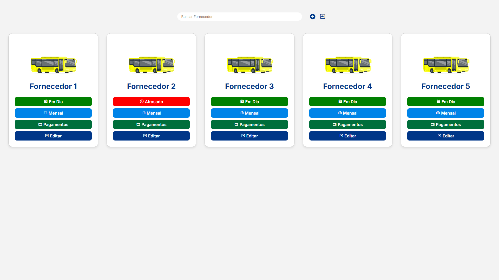

<h1 align="center">Programa Busdoor | Carflax</h1>

  

  
  

## 💻 Projeto

Este projeto foi criado com o objetivo de otimizar a gestão dos fornecedores envolvidos no programa Busdoor da CarFlax. Com ele, é possível gerenciar fornecedores de forma eficiente, acompanhando pagamentos e status, garantindo assim uma administração mais organizada e transparente.

- [Acesse o projeto](https://busdoor.vercel.app/)

## 🚀 Tecnologias

As seguintes tecnologias foram utilizadas no desenvolvimento deste projeto:

<strong>Firebase:</strong> Utilizado para gerenciamento de banco de dados.  
<strong>HTML e CSS:</strong> Para a estrutura e o estilo das páginas. 
<strong>JavaScript:</strong> Para interatividade e funcionalidades dinâmicas. 
<strong>Git e GitHub:</strong> Para controle de versão e hospedagem do código. 
<strong>Figma:</strong> Para o design das interfaces. 